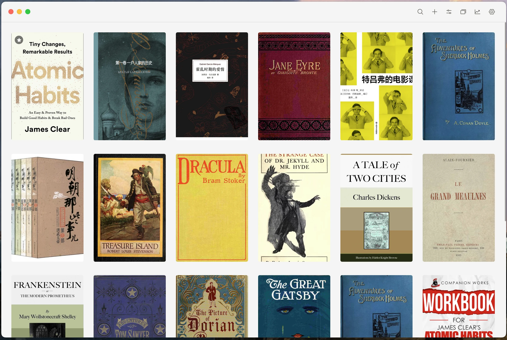
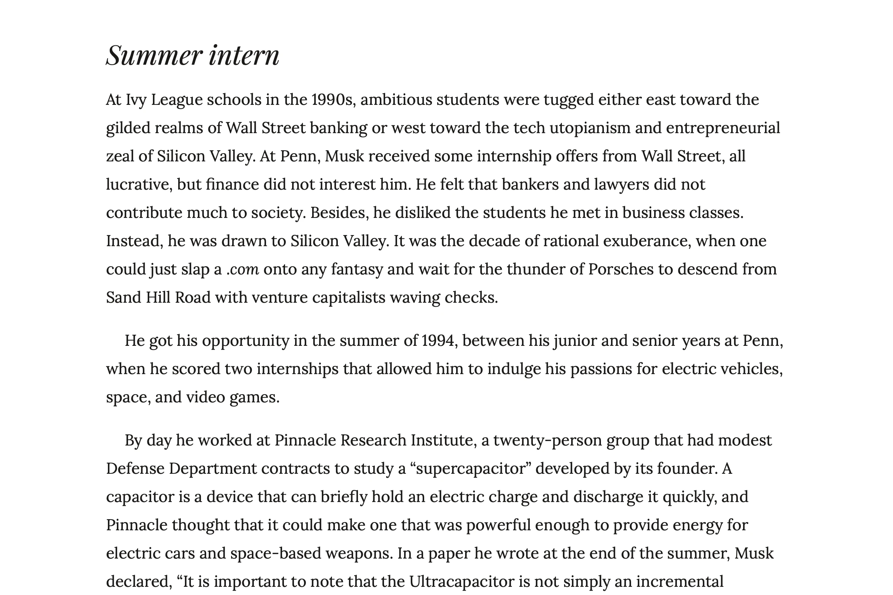
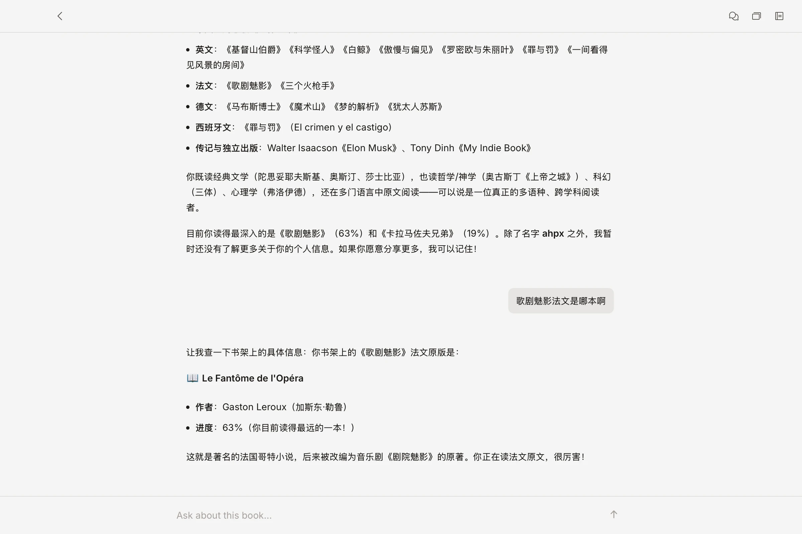

<div align="center">
  
  <h1>ReadAware</h1>
  <p><strong>Reading that remembers.</strong></p>
  <p>
    A local-first reading app that connects books, highlights, notes, and
    conversations into context you can carry forward.
  </p>
  <p>
    <a href="https://readaware.app">Website</a> ·
    <a href="https://github.com/ahpxex/read-aware/releases/latest">Download</a>
  </p>
</div>



## What ReadAware is

ReadAware is an AI-native reader for people who want more than a transcript
beside a book. It keeps the reading trace itself — the passages you mark, the
questions you ask, the ideas that recur — and uses that context when it becomes
relevant again.

- **One reader, every format.** EPUB, MOBI, AZW3, FB2, and PDF share one reading,
  selection, annotation, and progress model. Original files are opened directly;
  there is no conversion pipeline.
- **Memory, not an endless chat log.** Conversations are source material. The
  durable layer is structured memory scoped to the reader and their books.
- **Local-first by default.** Books, annotations, progress, conversations, and
  memory live on the device in SQLite and the native filesystem.
- **Bring your own model.** Inference is remote, but provider credentials and
  product data stay under the reader's control.
- **A quiet reading surface.** AI is available from the page without turning the
  page into an AI dashboard.

<table>
  <tr>
    <td width="50%"></td>
    <td width="50%"></td>
  </tr>
</table>

## System model

ReadAware ships as a Tauri application. The React app is the product interface;
Tauri owns the native filesystem, SQLite database, window integration, and
platform capabilities. The browser build exists for local UI development and
Storybook, not as a separate web product.

```text
Tauri app
├── React interface          shelf, reader, annotations, chat, settings
├── Local agent runtime      retrieval, context assembly, memory writes
├── SQLite                   product data, event log, FTS, projections
└── Native filesystem        imported book files and large blobs

Remote services
├── Model provider           inference through the reader's own account
└── Sync relay               encrypted event log and blobs; no business logic
```

The central invariant is simple: **raw domain events are the syncable record;
memory and search state are local, rebuildable projections.** Retrieval uses
SQLite FTS plus scope, recency, and importance signals rather than a default
vector database.

## Repository

This is a Bun workspace monorepo orchestrated by Turborepo.

| Path | Responsibility |
| --- | --- |
| `apps/web` | React 19 SPA, TanStack Router, Jotai, Tailwind CSS v4 |
| `apps/desktop` | Tauri 2 shell and Rust-native storage/platform commands |
| `apps/landing` | Public website and release downloads |
| `packages/agent` | Single-agent runtime, model adapters, retrieval, and memory pipelines |
| `packages/core` | Domain entities, events, and storage contracts |
| `packages/ui` | Shared design system and co-located Storybook stories |
| `packages/tsconfig` | Shared TypeScript configuration |

Architecture decisions and target data contracts live in
[`docs/agent-architecture.md`](docs/agent-architecture.md) and
[`docs/data-model.md`](docs/data-model.md).

## Run locally

Prerequisites: [Bun](https://bun.sh/), the Rust toolchain, and the native
dependencies required by Tauri for your platform.

```bash
bun install
bun run dev
```

`bun run dev` launches the real Tauri app and starts the Vite frontend through
Tauri's `beforeDevCommand`. Useful workspace commands:

| Command | Purpose |
| --- | --- |
| `bun run dev` | Run the Tauri app in development |
| `bun run dev:web` | Run only the UI shell in Vite |
| `bun run storybook` | Browse the design system and feature stories |
| `bun run typecheck` | Type-check all workspaces |
| `bun run build` | Build and type-check the application frontend |
| `bun run build:desktop` | Produce native desktop release bundles |
| `bun run build:landing` | Build the public website |

Product behavior must be verified in Tauri. A plain browser does not provide
the native IPC, SQLite, filesystem, book-blob, or production CSP paths used by
the shipped application.

## Releases

Tagged releases build macOS, Windows, Linux, and Android artifacts through
`.github/workflows/release.yml`. The workflow also produces signed desktop
updater artifacts and a verified Android update manifest.

ReadAware is under active development. See the
[latest release](https://github.com/ahpxex/read-aware/releases/latest) for the
currently packaged platforms and installation files.
