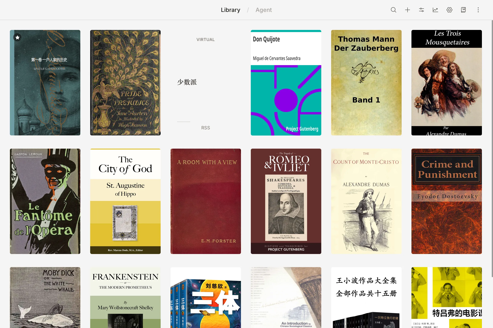
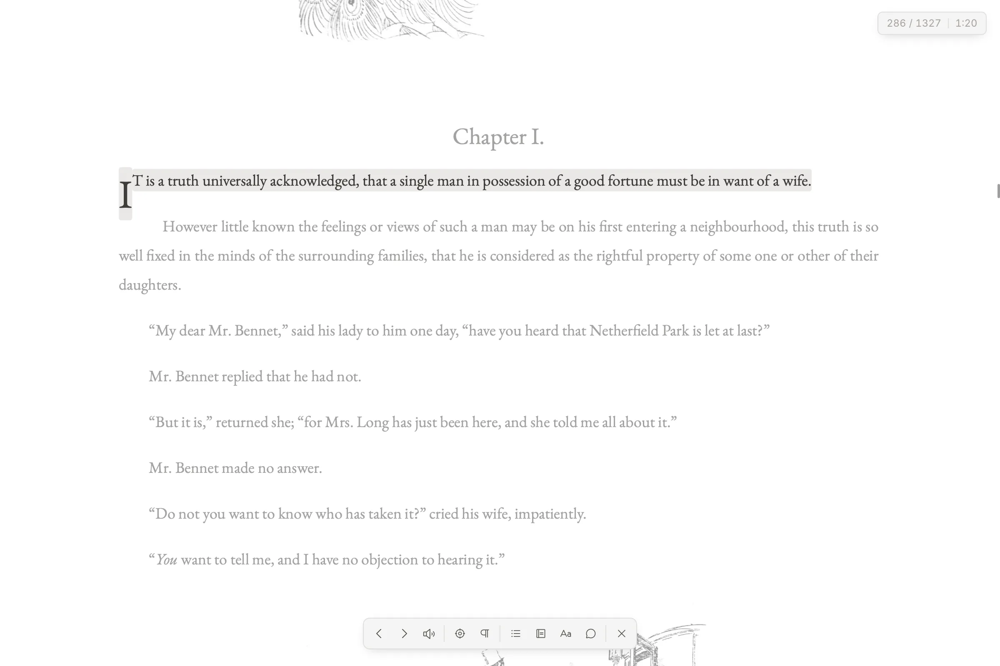
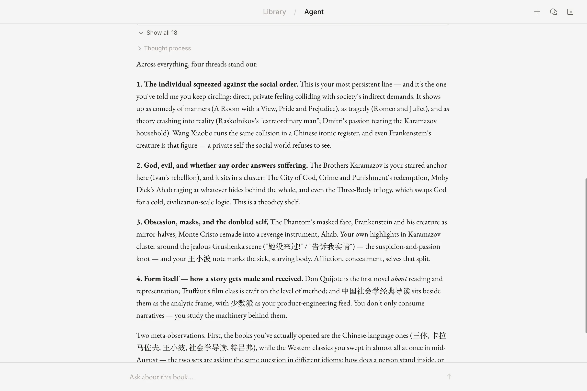

<div align="center">
  
  <h1>ReadAware</h1>
  <p><strong>Reading that remembers.</strong></p>
  <p>
    An agent-first reader with a plugin system at its core: one agent that
    understands your books, your annotations, and the ideas you keep returning
    to — inside an app built to be extended, eventually by the agent itself.
  </p>
  <p>
    <a href="https://readaware.app">Website</a> ·
    <a href="https://github.com/ahpxex/read-aware/releases/latest">Download</a> ·
    <a href="https://discord.gg/whDrKXwHWU">Discord</a>
  </p>
  <p>
    English · <a href="README.zh-CN.md">简体中文</a> · <a href="README.ja.md">日本語</a>
  </p>
</div>

<picture>
  <source media="(prefers-color-scheme: dark)" srcset="apps/landing/public/screenshots/shelf-dark.webp" />
  
</picture>

> ReadAware is free and built in the open. If it makes your reading better,
> [give it a star](https://github.com/ahpxex/read-aware) — stars are how new
> readers find the project.

## One reader. One agent. Open-ended plugins.

ReadAware is a free and open-source reader for macOS, Windows, Linux, Android,
and iOS. At its center is a single agent that can use tools, answer questions
in context, and build an evolving memory from the books, passages, notes, and
conversations that matter to you. Around it is a sandboxed plugin system that
extends the reader — and the agent — from the inside.

- **Stay with the sentence.** Sentence-by-sentence reading keeps the page calm,
  focused, and ADHD-friendly.
- **Mark things your way.** Underline, highlight, and write notes without
  breaking your reading flow.
- **Ask from the page.** Chat with AI about an unfamiliar passage, follow an
  idea further, or look up a word without leaving the book.
- **Extend it from the inside.** Install sandboxed plugins from the built-in
  marketplace: read-aloud voices, reading themes, dictionaries, feeds that
  read like books, new commands — and new tools the agent picks up and uses.
- **Keep words for later.** Annotate vocabulary as you read so it can become
  useful review material instead of a one-off lookup.
- **Make the page yours.** Switch languages, color themes, fonts, type sizes,
  spacing, and other reading settings.
- **See the habit forming.** Reading-time statistics make progress visible
  across books and sessions.
- **Bring almost any book.** EPUB, MOBI, AZW3, FB2, PDF, TXT, HTML, CBZ, and
  CBR share one reading, selection, annotation, and progress model, with no
  format conversion.

<table>
  <tr>
    <td width="50%"><picture>
  <source media="(prefers-color-scheme: dark)" srcset="apps/landing/public/screenshots/reader-dark.webp" />
  
</picture></td>
    <td width="50%"><picture>
  <source media="(prefers-color-scheme: dark)" srcset="apps/landing/public/screenshots/context-dark.webp" />
  
</picture></td>
  </tr>
</table>

## Why it feels different

Most apps bolt AI onto a sidebar. ReadAware is built the other way around: one
agent orchestrates retrieval, context assembly, tool use, and memory, and the
interface is a surface it can act on. Plugins extend the same seams from the
outside — sandboxed and permission-gated, they add voices, themes,
dictionaries, feeds, commands, and tools the agent immediately knows how to
use.

That combination is the long game: an agent that operates the app through the
same contracts plugins are written against can, eventually, extend the app for
you. The reader is designed to evolve itself.

The craft underneath is the floor, not the pitch. The interface stays quiet,
coherent, and tuned to the pixel — typography first, controls only when they
are useful, no AI slop — and the agent stays beside the reading experience
rather than taking it over, because a reader earns attention with the page,
not the chrome.

## Platforms

| Platform | Status |
| --- | --- |
| macOS | Available |
| Android | Available |
| Windows | Available; broader real-world testing is welcome |
| Linux | Available; broader real-world testing is welcome |
| iOS | Supported; App Store distribution is not available yet |

Cross-device sync is planned. Today, ReadAware is local-first: books, reading
progress, annotations, conversations, and memory stay on the device, while
remote model inference remains optional and provider-controlled.

## Architecture

ReadAware uses one agent to orchestrate retrieval, context assembly, tool use,
and memory updates. Chat transcripts are source material rather than the memory
system itself: durable context is built from the reader's ongoing trace across
books.

```text
ReadAware app
├── React interface          shelf, reader, annotations, chat, settings
├── Local agent runtime      tools, retrieval, context, memory updates
├── Plugin runtime           sandboxed workers, marketplace, contribution points
├── SQLite                   product data, event log, FTS, projections
└── Native filesystem        imported books and large blobs

Remote services
├── Model provider           optional inference through the reader's account
└── Sync relay               planned encrypted event and blob transport
```

The source of truth is local. Raw domain events form the syncable record;
memory and search state are rebuildable projections. Retrieval uses SQLite FTS
plus scope, recency, and importance signals rather than requiring a vector
database.

Plugins and the agent reach the product through the same domain API layer, and
every read, write, and event carries its origin — the user, a plugin, or the
agent. What the agent can do today, a plugin can extend tomorrow, and vice
versa.

The repository itself is a Bun workspace monorepo orchestrated by Turborepo.

| Path | Responsibility |
| --- | --- |
| `apps/web` | React 19 interface, TanStack Router, Jotai, Tailwind CSS v4 |
| `apps/desktop` | Tauri 2 shell and native storage/platform commands |
| `apps/landing` | Public website and release downloads |
| `packages/agent` | Agent runtime, model adapters, retrieval, and memory pipelines |
| `packages/core` | Domain entities, events, and storage contracts |
| `packages/ui` | Shared design system and co-located Storybook stories |
| `packages/plugin-types` | The public plugin API surface |
| `plugins/` | First-party plugins: dictionary, themes, RSS, read-aloud voices |

Architecture decisions and target data contracts live in
[`docs/agent-architecture.md`](docs/agent-architecture.md) and
[`docs/data-model.md`](docs/data-model.md). The plugin API reference and
publishing guide live at
[readaware.app/docs/plugins](https://readaware.app/docs/plugins).

## Releases

Version tags build macOS, Windows, Linux, and Android artifacts through
`.github/workflows/release.yml`. See the
[latest release](https://github.com/ahpxex/read-aware/releases/latest) for
current downloads and installation files.

## Sponsors

ReadAware is free and open source. A heartfelt thank-you to the sponsors
who help keep it that way:

- [ikeba Inc.](https://www.ikeba.jp/) — a Tokyo-based technology company
  building AI and medical businesses.

Interested in sponsoring ReadAware? Say hello on the
[ReadAware Discord](https://discord.gg/whDrKXwHWU).

## Community

Questions, ideas, bug reports, and reading stories are welcome on the
[ReadAware Discord](https://discord.gg/whDrKXwHWU).

## License

ReadAware is free and open source under the [GNU AGPL-3.0](LICENSE).

The public plugin API, [`@read-aware/plugin-types`](packages/plugin-types/LICENSE),
is MIT-licensed so third-party plugins can use any license they like.
