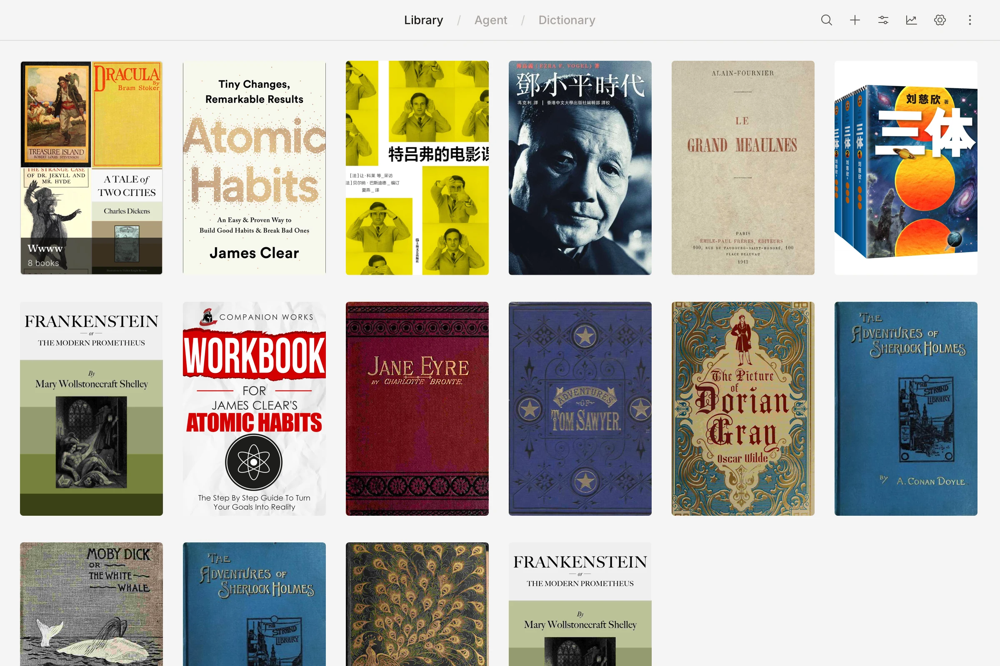
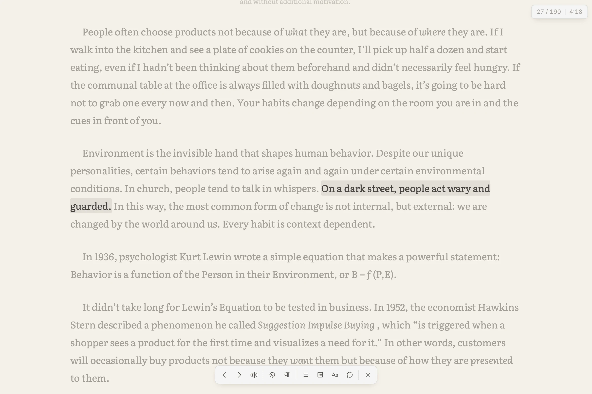
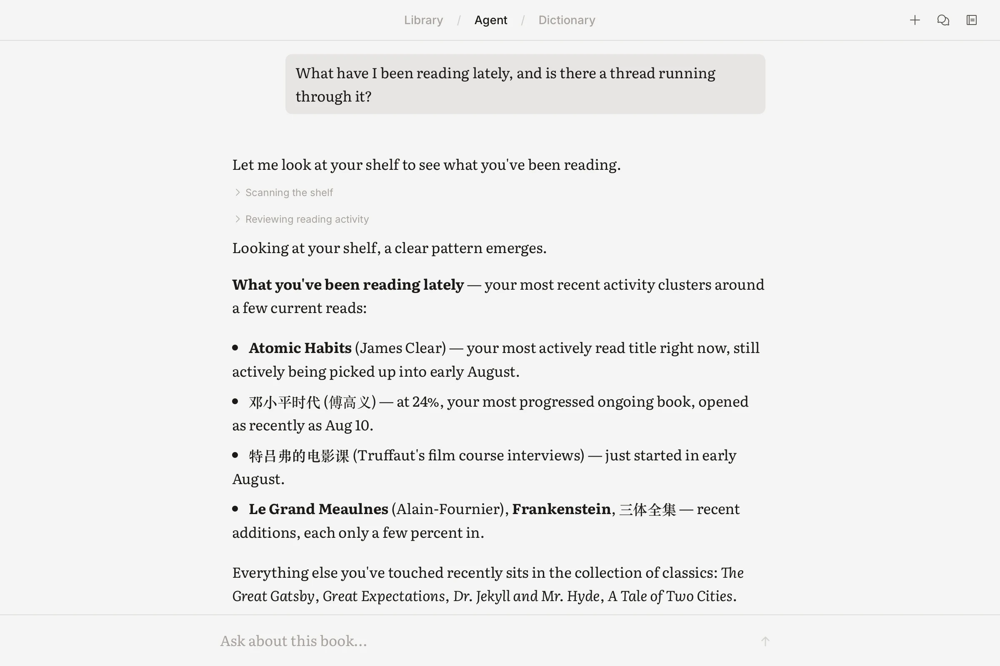

<div align="center">
  
  <h1>ReadAware</h1>
  <p><strong>Reading that remembers.</strong></p>
  <p>
    一款 agent-first 的阅读器，插件系统是它的核心：一个真正理解你的书、
    你的批注、以及你反复回到的那些想法的 agent，住在一个生来就能被扩展的
    应用里——未来，动手扩展它的可以就是 agent 自己。
  </p>
  <p>
    <a href="https://readaware.app">官网</a> ·
    <a href="https://github.com/ahpxex/read-aware/releases/latest">下载</a> ·
    <a href="https://discord.gg/whDrKXwHWU">Discord</a> ·
    <a href="https://linux.do/t/topic/2575893">LINUX DO</a>
  </p>
  <p>
    <a href="README.md">English</a> · 简体中文 · <a href="README.ja.md">日本語</a>
  </p>
</div>



> ReadAware 免费且完全开源。如果它让你的阅读更好，欢迎给项目
> [点一个 Star](https://github.com/ahpxex/read-aware)——这是新读者发现
> ReadAware 最重要的途径。

## 一个阅读器，一个 agent，开放的插件。

ReadAware 是一款免费开源的阅读器，支持 macOS、Windows、Linux、Android 和
iOS。它的中心是一个 agent——能调用工具、结合上下文回答问题，并从你在意的
书、段落、笔记和对话中构建一份持续生长的记忆。围绕它的是一套沙箱化的插件
系统，从内部扩展这个阅读器——也扩展这个 agent。

- **和句子待在一起。** 逐句阅读让页面保持安静、专注，对 ADHD 友好。
- **按你的方式做标记。** 划线、高亮、写笔记，都不打断阅读流。
- **就地提问。** 对着陌生段落直接和 AI 讨论、顺着一个想法追下去，或是查一个
  词，都不用离开书页。
- **从内部扩展它。** 从内置市场安装沙箱化插件：朗读音色、阅读主题、词典、
  读起来像书的订阅源、新命令——还有 agent 拿起来就能用的新工具。
- **把词留到以后。** 边读边给生词做批注，让它变成可复习的材料，而不是查完
  即忘的一次性检索。
- **把页面变成你的。** 语言、配色主题、字体、字号、行距等阅读设置都可切换。
- **看见习惯的形成。** 阅读时长统计让进度跨书籍、跨会话可见。
- **几乎什么书都能读。** EPUB、MOBI、AZW3、FB2、PDF、TXT、HTML、CBZ、CBR
  共用同一套阅读、选择、批注和进度模型，无需格式转换。

<table>
  <tr>
    <td width="50%"></td>
    <td width="50%"></td>
  </tr>
</table>

## 为什么感觉不一样

大多数应用把 AI 拧在侧边栏上。ReadAware 反过来：一个 agent 统筹检索、上下文
组装、工具调用和记忆，而界面是它可以操作的表面。插件从外部延伸同样的接缝——
沙箱化、权限受控，能加入音色、主题、词典、订阅源、命令，以及 agent 立刻就
会用的工具。

这个组合才是长线：agent 操作应用所走的契约，与插件的编写契约是同一套——
所以终有一天，它可以替你扩展这个应用。这个阅读器生来就是为了自我进化。

底下的工艺是地板，不是卖点。界面依旧安静、连贯、打磨到像素级——排版优先，
控件只在有用时出现，没有 AI 味——agent 也始终站在阅读体验旁边而不是接管它，
因为阅读器赢得注意力靠的是页面，不是壳。

## 平台

| 平台 | 状态 |
| --- | --- |
| macOS | 可用 |
| Android | 可用 |
| Windows | 可用；欢迎更多真实环境的测试 |
| Linux | 可用；欢迎更多真实环境的测试 |
| iOS | 已支持；App Store 分发暂未上线 |

跨设备同步在计划中。目前 ReadAware 是 local-first 的：书籍、阅读进度、批注、
对话和记忆都留在设备上，远程模型推理是可选的，且由你选择的服务商控制。

## 工作原理

ReadAware 用一个 agent 编排检索、上下文组装、工具调用和记忆更新。聊天记录
是原始素材而非记忆系统本身：持久上下文来自读者跨书籍的持续痕迹。

```text
ReadAware 应用
├── React 界面            书架、阅读器、批注、聊天、设置
├── 本地 agent 运行时     工具、检索、上下文、记忆更新
├── 插件运行时            沙箱 worker、市场、贡献点
├── SQLite                产品数据、事件日志、FTS、投影
└── 原生文件系统          导入的书籍与大块二进制

远程服务
├── 模型服务商            可选；通过读者自己的账号做推理
└── 同步中继              规划中的加密事件与 blob 传输
```

Source of truth 在本地。原始领域事件构成可同步的记录；记忆和检索状态是可
重建的投影。检索用 SQLite FTS 加范围、时近性和重要性信号，不需要向量数据库。

插件和 agent 通过同一层领域 API 触达产品，每一次读、写和事件都带着来源——
用户、某个插件，或是 agent。今天 agent 能做的，明天插件就能扩展，反之亦然。

## 仓库结构

ReadAware 是一个由 Turborepo 编排的 Bun workspace monorepo。

| 路径 | 职责 |
| --- | --- |
| `apps/web` | React 19 界面，TanStack Router、Jotai、Tailwind CSS v4 |
| `apps/desktop` | Tauri 2 外壳与原生存储 / 平台命令 |
| `apps/landing` | 官网与发布下载 |
| `packages/agent` | agent 运行时、模型适配、检索与记忆管线 |
| `packages/core` | 领域实体、事件与存储契约 |
| `packages/ui` | 共享设计系统与并置的 Storybook stories |
| `packages/plugin-types` | 公开的插件 API 面 |
| `plugins/` | 一方插件：词典、主题、RSS、朗读音色 |

架构决策与目标数据契约见
[`docs/agent-architecture.md`](docs/agent-architecture.md) 和
[`docs/data-model.md`](docs/data-model.md)。插件 API 参考与发布指南见
[readaware.app/zh/docs/plugins](https://readaware.app/zh/docs/plugins)。

## 本地运行

前置依赖：[Bun](https://bun.sh/)、Rust 工具链，以及 Tauri 在你的平台上需要
的原生依赖。

```bash
bun install
bun run dev
```

常用命令：

| 命令 | 用途 |
| --- | --- |
| `bun run dev` | 以开发模式运行 Tauri 应用 |
| `bun run dev:web` | 只在 Vite 里跑 UI 外壳 |
| `bun run storybook` | 浏览设计系统与功能 stories |
| `bun run typecheck` | 对所有 workspace 做类型检查 |
| `bun run build` | 构建并类型检查应用前端 |
| `bun run build:desktop` | 产出原生桌面发布包 |
| `bun run build:landing` | 构建官网 |

产品行为必须在 Tauri 里验证。普通浏览器不具备正式应用所使用的原生 IPC、
SQLite、文件系统、书籍 blob 和生产 CSP 路径。

## 发布

版本 tag 会通过 `.github/workflows/release.yml` 构建 macOS、Windows、Linux
和 Android 产物。最新下载与安装文件见
[latest release](https://github.com/ahpxex/read-aware/releases/latest)。

## 社区

- [ReadAware Discord](https://discord.gg/whDrKXwHWU)——提问、反馈 bug、聊想法、
  分享阅读故事都欢迎。
- [LINUX DO 发布帖](https://linux.do/t/topic/2575893)——中文讨论也可以在这里
  继续。

## 许可证

ReadAware 基于 [MIT License](LICENSE) 免费开源。
