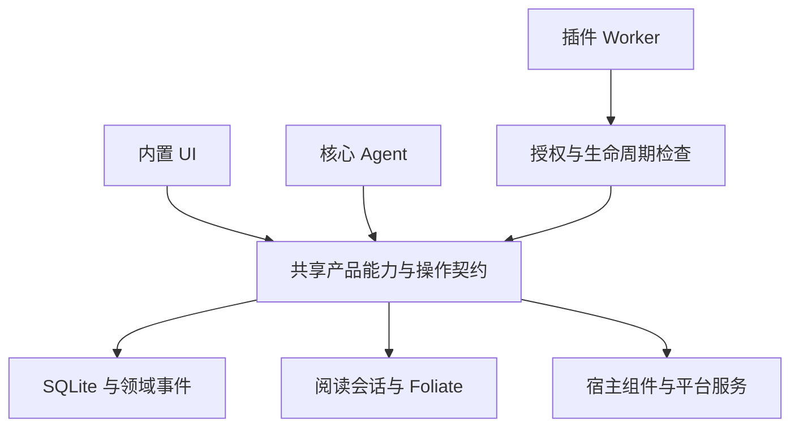

# ReadAware 插件能力完备基线

人读版：[能力地图与裁决](./plugin-capability-baseline.html)。现行 API 手册：[plugin-system.md](./plugin-system.md)。

- 状态：**审计完成；目标契约待实现、待验收。不是“插件能力已经补齐”。**
- 最后核验日期：2026-09-07。
- 审计基准：HEAD `fe87e379338faa76e3e39b3460e128d66df38263` 及当时工作区；工作区另有阅读计时和同步修改，本次不修改、不提交这些修改。
- 讨论范围：当前 ReadAware Tauri 桌面产品已有的产品行为，以及使这些行为可供插件组合所必需的公共接口基础设施。不是所有可能的软件、所有操作系统能力或未来阅读引擎。
- 标记：**[代码]** 当前源码可证；**[设计]** 本文提出的目标，不是当前 API；**[环境]** 必须在真实运行环境另行验收。
- 本次交付：能力清单、边界、操作语义、验收标准。没有实施宿主重构，没有实施 Jumper，没有宣称通过产品端到端验收。

## 1. 承诺的精确定义

**[设计] 基线通过验收后，使用本基线允许的对象、操作、挂载点和声明式交互来编写新插件，只改插件，不改宿主。**

插件的新算法、外部 HTTP 服务、章节编号规则、导出格式、文本分段规则、内容来源，不是宿主能力更新。不能再用这些理由临时增加宿主接口或插件 ID 分支。

新增渲染原语、书籍格式解码器、系统级权限、设备接口、宿主原先不存在的数据模型或产品流程，才属于新的宿主能力。发现基线内能力缺失、参数不能组合、没有结果反馈或公开类型落后，属于**基线违约/缺陷**，不是“新需求”。

这个承诺有三个条件：基线已经实现并验收、插件获得所需权限、当前书籍/平台/资源确实支持相关操作。拒绝授权、纯图片书没有可搜索文本、DRM、网络服务停机，不通过偷偷扩权或伪造成功解决。

“宿主能力不变”必须同时包含**行为、数据、呈现与平台服务**。在保留 Worker 隔离和宿主组件库的前提下，无法诚实承诺任意新 UI 原语和任意原生操作永远不需要宿主更新。

### 1.1 五种状态

| 状态 | 含义 | 如何验收 |
| --- | --- | --- |
| E 已开放 | 已存在对应公共入口，限表中明确列出的语义 | 保留回归测试；E 不代表本次已验证生产运行 |
| P 不完整 | 有公共入口，但缺少该行列明的组合或生命周期语义 | 必须补齐后才可计入基线通过 |
| M 未开放 | 宿主或引擎已有行为，插件没有正式入口 | 提取共享操作；不能从插件调用内部模块 |
| B 基础设施 | 尚无通用实现，但要兑现不改宿主承诺就必须一次建设 | 本基线内的必要工作，不伪称“宿主已有” |
| X / F 边界 | X 禁止直接获得的权力；F 当前宿主没有的产品能力 | 见独立边界表，不混进“已经支持”数量 |

所有 E/P/M 状态是**[代码]**判断，所有“基线必须具备”的内容是**[设计]**。一行有多个操作时，以最弱的一环判定，不用一个已存在的方法代表整行完成。

本版共有 **18 组、129 个能力验收项**：E 21、P 33、M 33、B 42。另列 X 9 项、F 9 项。这里数的是验收项，不是函数数量；一个验收项可以包含多个紧密关联的操作。108 个非 E 项不等于 108 个“原来已经有、只是忘记导出的方法”。

## 2. 根本规则

1. **同一产品操作，一个实现。** 内置 UI、Agent、插件使用同一领域/运行时接口，区别是调用者身份、授权范围和用户确认，不是各写一套功能。
2. **数据库不是整个产品。** 持久化领域命令、当前会话操作、临时呈现操作分别建模；导航历史、搜索任务和选区不因“不入事件库”而失去公共入口。
3. **拥有实现不等于禁止调用。** DOM、音频、文件句柄、SQLite、密钥由宿主持有；插件拿到的是受控对象引用和操作，不是底层对象。
4. **组合必须闭合。** 列表/搜索/事件产生的引用，必须能直接传给读取/定位/标注操作；状态可读，完成可确认，失败可分类，资源可释放。
5. **无需新增产品状态的组合在插件内完成。** 私有书签、学习计划、复习卡片、导出布局可用私有存储和公共操作实现，不为每种插件新增宿主业务表。
6. **不制造通用逃生口。** 不提供任意字符串调用 Rust、执行 SQL、访问任意路径、注入 JSX/CSS/JS 的接口。
7. **现有三类架构保留。** Domain 表达产品数据/行为；Contribution 表达可替换实现和挂载；Service 表达受控设施。这里的能力分组不是要求创造同样数量的顶层命名空间。

结论：不是把内置 UI 包成插件，而是让内置 UI 不再享有绕过公共产品能力层的私有业务入口。存储驱动、渲染器内部调用不因此全部公开。

## 3. 证据索引

下表源文件是审计入口；后续表中的 S 编号指向这里。源码是当前事实，目标操作描述不是已导出的函数签名。

| 编号 | 当前源码及核验对象 |
| --- | --- |
| S01 | [plugin-types](../packages/plugin-types/src/index.ts)：全部公开域、服务、贡献、视图、事件类型 |
| S02 | [capabilities](../packages/core/src/capabilities.ts)、[domains](../packages/core/src/domains.ts)、[registry](../apps/web/src/domain/registry.ts)：分类、版本、授权与领域工厂 |
| S03 | [plugin-context](../apps/web/src/features/plugins/runtime/plugin-context.ts)：实际提供给 Worker 的接口及人工适配 |
| S04 | [library domain](../apps/web/src/domain/library.ts)、[read-models](../packages/core/src/read-models.ts)：目录去掉 hrefs，书库命令与读模型 |
| S05 | [reading domain](../apps/web/src/domain/reading.ts)、[reader session](../apps/web/src/features/reader/hooks/useReaderSession.ts)、[reader-nav](../apps/web/src/features/plugins/state/reader-nav.ts)：统计与导航分离 |
| S06 | [FoliateReaderView](../apps/web/src/features/reader/components/FoliateReaderView.tsx)、[view](../apps/web/foliate-js/src/view.ts)、[history](../apps/web/foliate-js/src/history.ts)、[book-search](../apps/web/foliate-js/src/book-search.ts)：精确定位、搜索、选择、历史 |
| S07 | [book-text-store](../apps/web/src/features/library/lib/book-text-store.ts)、[book-text-port](../apps/web/src/features/ai/agent/ports/book-text-port.ts)：抽取、正文状态、Agent 搜索与 hrefs |
| S08 | [annotations domain](../apps/web/src/domain/annotations.ts)、[annotation-db](../apps/web/src/features/annotations/lib/annotation-db.ts)：标注、笔记、ask 的读写边界 |
| S09 | [conversations domain](../apps/web/src/domain/conversations.ts)、[conversation-store](../apps/web/src/features/ai/lib/conversation-store.ts)、[agent workspace](../apps/web/src/features/agent/components/AgentWorkspace.tsx)：会话只读面与宿主对话 |
| S10 | [settings catalog](../apps/web/src/domain/settings/catalog.ts)、[settings domain](../apps/web/src/domain/settings/domain.ts)、[settings types](../packages/core/src/settings.ts)：路径目录、目标、授权、原子批量修改 |
| S11 | [reader settings](../apps/web/src/features/settings/lib/reader-settings.ts)、[shortcut settings](../apps/web/src/features/settings/lib/shortcuts.ts)、[shelf view](../apps/web/src/features/shelf/lib/shelf-view.ts)：宿主设置集合 |
| S12 | [command builder](../apps/web/src/features/command/lib/build-commands.tsx)、[menu registry](../apps/web/src/features/menus/lib/menu-registry.tsx)、[panel intent](../apps/web/src/features/reader/state/panel-intent.ts)、[Agent header](../apps/web/src/features/agent/hooks/useAgentHeaderActions.tsx)：实际 UI 操作与挂载 |
| S13 | [view normalizer](../apps/web/src/features/plugins/lib/plugin-view.ts)、[view renderer](../apps/web/src/features/plugins/components/PluginViewRenderer.tsx)、[list body](../apps/web/src/features/plugins/components/PluginListViewBody.tsx)、[form body](../apps/web/src/features/plugins/components/PluginFormViewBody.tsx)：声明式交互与校验 |
| S14 | [UI package](../packages/ui/src/index.ts)、[header cluster](../apps/web/src/features/plugins/components/PluginHeaderCluster.tsx)：组件与宿主容器 |
| S15 | [text-unit navigator](../apps/web/src/features/reader/hooks/useTextUnitNavigator.ts)、[read aloud](../apps/web/src/features/reader/hooks/useReadAloud.ts)、[voice resolution](../apps/web/src/features/reader/lib/read-aloud-voice.ts)：分段模式、语音与播放控制 |
| S16 | [agent runtime](../apps/web/src/features/ai/agent/agent-runtime.ts)、[plugin tools](../apps/web/src/features/plugins/runtime/plugin-tools.ts)、[extension context](../packages/agent/src/runtime/extension-context.ts)：推理与 Agent 扩展消费 |
| S17 | [memory port](../apps/web/src/features/ai/agent/ports/memory-port.ts)、[book memory port](../apps/web/src/features/ai/agent/ports/book-memory-port.ts)、[profile port](../apps/web/src/features/ai/agent/ports/profile-port.ts)：记忆、摘要、画像当前实现 |
| S18 | [worker host](../apps/web/src/features/plugins/runtime/plugin-worker-host.ts)、[sandbox](../apps/web/src/features/plugins/runtime/plugin-sandbox.worker.ts)：RPC、缓冲网络响应、调用与资源生命周期 |
| S19 | [plugin backend](../apps/web/src/features/plugins/runtime/plugin-backend.ts)、[plugins.rs](../apps/desktop/src-tauri/src/plugins.rs)：文档存储、安装、资产和版本候选 |
| S20 | [domain events](../apps/web/src/domain/events.ts)、[app events](../apps/web/src/platform/app-events.ts)、[core events](../packages/core/src/events.ts)：观察范围与新旧事件 |
| S21 | [scheduler](../apps/web/src/features/plugins/runtime/plugin-scheduler.ts)、[lifecycle](../apps/web/src/features/plugins/runtime/plugin-lifecycle.ts)、[update transaction](../apps/web/src/features/plugins/runtime/plugin-update-transaction.ts)：调度、激活屏障、迁移和回滚 |
| S22 | [sync engine](../apps/web/src/platform/sync/sync-engine.ts)、[transport registry](../apps/web/src/platform/sync/transport-registry.ts)、[transport feed](../apps/web/src/platform/sync/transport-feed.ts)：宿主同步与密文传输扩展 |
| S23 | [export file](../apps/web/src/platform/export-file.ts)、[pick book files](../apps/web/src/features/library/lib/pick-book-files.ts)、[blob store](../apps/web/src/platform/blob-store.ts)、[HTTP client](../apps/web/src/platform/http-client.ts)、[external link](../apps/web/src/platform/external-link.ts)：受控文件、网络和外部打开 |
| S24 | [backup](../apps/web/src/features/settings/lib/backup-io.ts)、[diagnostics](../apps/web/src/features/settings/lib/diagnostics.ts)、[delete all](../apps/web/src/features/settings/lib/delete-all-data.ts)、[update feature](../apps/web/src/features/update)：高风险宿主流程 |
| S25 | [Rust entry](../apps/desktop/src-tauri/src/lib.rs)、[storage](../apps/desktop/src-tauri/src/storage)、[errors](../packages/core/src/errors.ts)：底层能力与不可直接公开的权力 |
| S26 | [registry tests](../apps/web/src/domain/registry.test.ts)、[worker tests](../apps/web/src/features/plugins/runtime/plugin-worker-host.test.ts)、[capability tests](../apps/web/src/features/plugins/runtime/plugin-capabilities.test.ts)：当前验证覆盖边界 |

## 4. 完整能力清单

### A. 对象身份、位置与能力发现

| ID | 状态 | 基线必须具备的操作与输出 | 当前缺口 / 证据 |
| --- | --- | --- | --- |
| A01 | P | 发现获授权能力、版本、操作输入输出、限制、支持格式、当前可用性及不可用原因 | 现有 discovery 是分类版本，不是完整操作描述；S01/S02 |
| A02 | B | 统一 BookRef、ChapterRef、Location、TextRange、SessionRef、ResourceRef；可序列化，明确有效期 | 现有 index/href/cfi 分散；不能要求插件构造 CFI；S04/S06 |
| A03 | M | 将目录条目、正文命中、页码/进度、标注引用解析为可定位的位置 | Foliate 可解析；公开目录没有 href；S04/S06/S07 |
| A04 | B | 位置验证与失效报告：书被删除/合并、资源变更、会话已关闭、位置不再可解析 | 不把失效对象变成静默 no-op；S05/S06 |
| A05 | B | 操作回执：completed/cancelled/failed，实际结果位置、任务或对象引用 | goTo/openBook 当前返回 void；S01/S03/S05 |
| A06 | B | 查询快照与变化订阅的无丢失衔接，携带 revision；稳定分页/排序/上限 | 当前公共查询和订阅相互独立；S01/S20 |
| A07 | P | locale、时区、平台、在线性、宿主就绪状态、功能/格式支持信息 | locale/appVersion 已有；剩余没有统一环境快照；S01/S23/S25 |

### B. 书库、集合与书籍生命周期

| ID | 状态 | 基线必须具备的操作与输出 | 当前缺口 / 证据 |
| --- | --- | --- | --- |
| B01 | E | 枚举/读取书籍的 ID、标题、作者、格式、收藏、集合、时间、文件名/大小、叙事分类 | library.queries.books.list/get；S01/S04 |
| B02 | P | 元数据编辑、收藏切换、删除书籍；批量操作给逐项结果和明确原子性 | 单项已开放；宿主 removeMany 未出现在插件命令；S03/S04 |
| B03 | E | 集合列表、成员查询、创建、重命名、删除、批量分配书籍 | 保持当前单集合归属，不虚构多标签模型；S01/S04 |
| B04 | P | 从字节/受控文件引用导入已有支持格式，报告重复/合并/失败/取消与进度 | importBook 字节入口已开放；不具备完整任务反馈/文件引用；S01/S04/S23 |
| B05 | M | 获取书籍封面、源文件可用状态和可撤销资源引用；授权导出原文件 | BookSummary 无封面/资源入口；宿主有 blob 与封面；S04/S23/S25 |
| B06 | M | 查询重复候选、预览合并影响、通过宿主批准流程合并；返回旧新 ID 映射 | 宿主存在去重/合并路径与事件，不给插件直接伪造 book.merged；S20/S25 |
| B07 | P | 创建/读取/移除插件自有虚拟书；更新自有标题/内容版本、失效重载 | add/remove 有，通用刷新/版本与标题更新入口不完整；S01/S03/S04 |
| B08 | M | 查询书文件缺失/等待同步/可读/不支持/DRM 等状态，请求宿主重试取回或重新导入流程 | 不让“没有文件”变成“空书”；S05/S23 |

### C. 正文、目录、搜索与资源

| ID | 状态 | 基线必须具备的操作与输出 | 当前缺口 / 证据 |
| --- | --- | --- | --- |
| C01 | P | 原书分层目录、稳定条目 ID、父子关系、标题、可导航位置；明确与抽取章节的映射 | getToc 当前是抽取章节数组，不是完整导航目录；S04/S06/S07 |
| C02 | P | 按章节/范围读取正文，返回坐标、来源、语言和可用状态 | 当前只给章节字符串；抽取文本偏移不等于 DOM/CFI；S01/S07 |
| C03 | M | 显式准备/查询文本抽取任务，区分未抽取、处理中、成功、无文本、部分失败 | Agent 有 getTextStatus；插件没有同等查询；S07 |
| C04 | M | 当前书精确搜索，返回章节、命中片段、可跳转范围；支持引擎现有匹配选项 | Foliate search 和 CFI 已有；公共域未开放；S06 |
| C05 | M | 已抽取书籍的跨书检索、限定书/章节范围、上限与证据来源 | Agent bookText.searchText 已有；不等同于定位精确搜索；S07 |
| C06 | B | 搜索任务取消、分批结果、进度、结果游标、截断说明；新查询作废旧结果 | 引擎有局部取消，但无完整插件任务契约；S06/S18 |
| C07 | M | 范围附近上下文、当前可见文本、句段文本与位置对应关系 | 宿主有选区上下文和文本单元索引，插件只能在特定回调接收部分数据；S06/S15 |
| C08 | M | 安全读取/显示书内图片、脚注、链接目标和已存在资源；返回资源引用而非本地路径 | 宿主有脚注/图片呈现；公共内容面仅纯文本；S06/S23 |

### D. 活跃阅读会话与导航

| ID | 状态 | 基线必须具备的操作与输出 | 当前缺口 / 证据 |
| --- | --- | --- | --- |
| D01 | M | 查询当前打开的书、会话 ID、加载状态、当前章节和准确位置 | 统计不是活跃会话快照；session 只有订阅；S01/S05 |
| D02 | P | 打开书/恢复进度、等待 ready、关闭当前书；支持显式目标会话 | openBook 只有请求，无 ready/结果；关闭未开放；S05 |
| D03 | P | 跳转到 Location/章节/命中范围/标注，验证目标后返回实际落点 | 当前 cfi/href fire-and-forget；S01/S05/S06 |
| D04 | M | 上/下一页、上/下一章、书首/书尾，返回到边界/已移动 | 引擎与内置快捷键有；S06/S11 |
| D05 | M | 按进度定位、固定版式页索引定位；区分页索引、印刷页标签和重排位置 | 引擎 goToFraction 与页面定位有；不能把重排页数伪装稳定页码；S06 |
| D06 | M | 读取可前进/可后退、历史目标；执行前进/后退 | Foliate history 有，未开放；S06 |
| D07 | B | 所有用户可感知跳转统一历史：目录、搜索、注释、脚注返回、插件；普通翻页只更新当前位置 | 需要统一入口与行为验收，不能每插件自建宿主导航栈；S05/S06 |
| D08 | M | 读取/改变沉浸阅读、打开/关闭目录/注释/外观/聊天面板、恢复阅读焦点 | 存在 UI 状态与 panel intent；S05/S12 |
| D09 | M | 固定版式缩放、适配、图片预览的宿主已有操作，受格式支持约束 | 不开放布局节点或全局手势劫持；S06 |
| D10 | B | 取消/序列化并发导航；A 书的旧操作不能落到 B 书；不成功不推进历史 | 不能只靠 UI 的 requestId 消重；S05/S06 |
| D11 | P | 会话打开/关闭/就绪/位置/章节/模式/历史变化订阅，含 reason 与 origin | 当前只有 4 个会话事件，且 position 仅 fraction；S01/S20 |
| D12 | B | 无书、加载中、关闭后、恢复失败时的 availability；读取与订阅不要求模拟一次用户翻页 | 禁止把监听不到过去事件当成插件自己负责；S01/S05 |

### E. 选区与临时书内呈现

| ID | 状态 | 基线必须具备的操作与输出 | 当前缺口 / 证据 |
| --- | --- | --- | --- |
| E01 | P | 当前选区快照/变化：文本、范围、书、章节、上下文、方向 | selectionActions 回调有部分字段，通用快照/事件缺失；S01/S06 |
| E02 | M | 选择范围、清除选择、滚动到范围、聚焦文本；保持键盘与辅助功能 | 引擎 select/deselect 有；S06 |
| E03 | M | 插件自有临时强调：显示/更新/清除多个范围，宿主语义样式 | 引擎覆盖层有；不能冒用持久化高亮实现临时搜索命中；S06 |
| E04 | B | 临时标记、范围预览和操作的 handle 生命周期：关闭视图/换书/禁用清理 | 插件不得删除别的插件或用户的标记；S06/S21 |
| E05 | M | 引用片段/脚注/图片的宿主预览，关闭后回原位置；链接区分书内/外部 | 复用已有呈现，不注入任意网页；S06/S23 |
| E06 | B | 选区、命中、文本单元的公共位置互通；标注创建无须插件自行生成 CFI | 当前输入输出不能全程闭合；S01/S04/S06 |

### F. 高亮、笔记与问题轨迹

| ID | 状态 | 基线必须具备的操作与输出 | 当前缺口 / 证据 |
| --- | --- | --- | --- |
| F01 | E | 跨书/按书/按类型/按关键词列出标注，包含文本、来源和已有位置 | annotations.queries.list；S01/S08 |
| F02 | E | 创建高亮/下划线、改色、删除；创建/编辑正文/删除笔记 | 只计当前命令实际支持字段，不许泛称任意标注更新；S01/S08 |
| F03 | P | 按 ID 读取、稳定排序/分页、批量修改/导出逐项结果和版本冲突语义 | 当前主要是 list 与单项命令；S01/S08 |
| F04 | P | 从任意可解析范围创建标注、反查出处并定位；可明确保存无位置笔记 | 回调范围能用，但目录/搜索范围的公共生产端不完整；S01/S06 |
| F05 | M | 用户批准后删除 ask 轨迹；读取其来源；禁止伪造 Agent 自动记录 | 宿主 annotations.commands.removeAsk 有，插件面没有；S08 |
| F06 | P | 完整标注变化事件、origin、快照衔接；同步变化同样可观察 | 当前实时事件已开放，但无持久游标/无丢失组合契约；S01/S20 |

### G. 阅读统计与会话记录

| ID | 状态 | 基线必须具备的操作与输出 | 当前缺口 / 证据 |
| --- | --- | --- | --- |
| G01 | E | 单书、全部书、总览统计：状态、位置、每日时间、首次/最近阅读 | reading.queries.stats；S01/S05 |
| G02 | E | 标记读完/取消读完，走正式领域命令 | reading.commands.setFinished；S01/S05 |
| G03 | M | 指定日期窗口查询已结算会话与当前待结算时间，区分精确值/临时值 | 宿主已有 reading_sessions_pending；不能只用累计时长倒推区间；S25 |
| G04 | P | 订阅真实生效的阅读记录事件，包括 book.sessionRecorded | S20 的 READING_EVENTS 已含新事件，S01 的 ReadingDomainEventType 未含；必须消除类型漂移 |
| G05 | B | 统计导出使用当前 canonical 会话模型，明确时区/小时桶/去重；不得任意写时长伪造阅读 | 导出可由插件编排，但需要 G03 的查询和稳定来源；S05/S25 |

### H. 全量用户设置

| ID | 状态 | 基线必须具备的操作与输出 | 当前缺口 / 证据 |
| --- | --- | --- | --- |
| H01 | E | discover/read/update/subscribe，精确路径授权、动态选项、global/book 目标、批量验证 | 现有 Settings Domain 是可复用基础；S01/S10 |
| H02 | P | 覆盖所有已有阅读设置：主题、字体、字号、字重、行段距、页边距、对齐、重排/固定版式模式、固定版式原色 | textAlign、fixedLayoutColor 在 S11 有，但 S10 未登记 |
| H03 | M | 书架布局、排序、分组、筛选；快捷键绑定的查询/修改与冲突检查 | S11/S12 已有宿主行为，Settings catalog 未覆盖 |
| H04 | P | 已有通用/外观/AI 非敏感配置与动态模型选项全部同源；敏感连接设置通过宿主交互 | 路径已覆盖一组设置；provider/凭据等不是普通可写项；S10/S16 |
| H05 | P | 获取有效值与来源、覆盖状态，设置/清除单书覆盖、恢复默认 | current update 有 global/book/all-books；单项 reset 与默认值可发现性须补契约；S10 |
| H06 | E | 插件自有声明设置、动态选项、密钥字段；读写他插件设置必须按精确路径授权 | 不因“插件之间集成”绕过 secret 排除规则；S01/S03/S10 |

### I. 应用导航、命令与挂载点

| ID | 状态 | 基线必须具备的操作与输出 | 当前缺口 / 证据 |
| --- | --- | --- | --- |
| I01 | M | 打开书架、Agent、统计、集合、指定设置页/插件页；查询当前视图和选择对象 | 宿主 command builder 有动作，插件 services.ui 没有；S12 |
| I02 | P | 注册命令与默认快捷键；读取适用上下文/可用性，宿主处理冲突、重绑定 | 注册与默认键已有；命令没有统一 context/enablement 契约；S01/S11 |
| I03 | B | 发现并调用获授权的已登记产品命令，带类型化参数与回执 | 不是任意字符串 invoke；命令必须引用同一领域操作并重新鉴权；S12 |
| I04 | E | 书架/阅读 header 动作，阅读选区/注释/navigator 动作，命令面板入口 | 保持用户决定显示位置/溢出；S01/S12/S14 |
| I05 | M | 将现有书籍/集合/标注上下文菜单、Agent header 的同类操作位置开放为语义槽位 | 当前 header surface 只有 shelf/reader，不能说所有现有菜单已可扩展；S01/S12 |
| I06 | B | 同一声明视图可挂载为插件页面、阅读侧面板、popover/dialog；跨打开/刷新保持 viewId | 宿主有相应容器，但没有通用 reader panel contribution；S12/S14 |
| I07 | B | 动态 visible/enabled/checked、上下文对象快照、排序/分组、卸载撤销 | 条件是声明式谓词/受控状态，不是插件读取 UI DOM；S01/S12 |
| I08 | P | 查询/修改菜单放置、打开插件自身贡献；禁止静默强行固定入口、抢焦点、覆盖核心快捷键 | settings 中 menus 路径已有；视图打开的可编程生命周期仍不完整；S10/S14 |

### J. 声明式 UI 的表达与交互

| ID | 状态 | 基线必须具备的操作与输出 | 当前缺口 / 证据 |
| --- | --- | --- | --- |
| J01 | E | markdown/list/form/blocks/detail；宿主排版、分组、列、指标、进度、引用、词典呈现 | 具体 union 见附录；不能等同于整个 @read-aware/ui 已开放；S01/S13 |
| J02 | E | 文本、多行、时间、数字、选择、密钥、toggle、checkbox、choice；显隐条件、字段错误、动态选项 | 当前 PluginFormField 与 PluginFormView；S01/S13 |
| J03 | P | 本地/异步搜索，输入保持、结果分页、查询取消、命中选择、键盘上下/回车 | 当前 searchable 仅过滤已有 items；可用表单提交替代不等于此交互已支持；S01/S13 |
| J04 | B | 可观察 view 状态/受控刷新，稳定 key，局部状态更新不丢焦点/滚动/表单值 | 当前主要通过回调返回新 view；事件不能普遍推送到活跃视图；S13 |
| J05 | B | 动作 disabled/checked/busy、图标工具栏、次级动作与上下文菜单 | 现有 action 只有基础标签/图标/variant/run；S01/S13 |
| J06 | B | 通用单选/多选列表、树/分层目录、语义表格的排序筛选、列表重排 | 宿主有列表/目录/书架选择；需要统一语法而非每插件专用 view kind；S12/S13/S14 |
| J07 | B | 语义标签页、折叠、详情与列表组合、受控尺寸/滚动区；复用现有宿主布局原语 | timeline 的固定日期 tabs 不等于通用 tabs；S13/S14 |
| J08 | B | 安全图片/封面/资源展示、链接与位置预览；资源可撤销、替代文字必填 | markdown 不替代受控本地媒体资源 API；S13/S14/S23 |
| J09 | P | loading/empty/error/retry/progress/cancel 统一状态；业务失败用 InlineError/字段错误/toast | 当前宿主有 busy/toast/字段错误，缺完整插件状态模型；S13 |
| J10 | P | push/replace/reset/close、返回、模态结果、视图关闭回调/清理、恢复原阅读焦点 | 前四项已有；完整生命周期与模态返回值未统一；S01/S13 |
| J11 | P | locale 变化、可访问标签、键盘、窄窗口、超长文本、减少动画由宿主统一处理 | 当前有 PluginText 和 host renderer，仍需契约与场景验证；S01/S13/S14 |
| J12 | B | 所有公共 schema 的运行时验证、嵌套/数量/资源上限、事件序列和 stale generation 行为同源 | 现有 normalizer 是基础；新增动态语义必须一起进入校验器；S13/S18 |

### K. 阅读模式与朗读

| ID | 状态 | 基线必须具备的操作与输出 | 当前缺口 / 证据 |
| --- | --- | --- | --- |
| K01 | E | 贡献文本单元分段算法、单位、文案和模式设置 | 当前 kind 仅 text-unit-navigator，不能解释为任意渲染模式；S01/S15 |
| K02 | M | 列出/启用/停用现有模式，选择单位，读当前单元，上/下单元、回当前、跟随开关 | 宿主文本单元导航已有，公共控制缺失；S15 |
| K03 | E | 贡献语音供应商、列出 voice、将文本合成为编码音频字节 | 宿主管理播放/预取/系统语音回退；S01/S15 |
| K04 | M | 查询朗读状态、开始/停止当前单元朗读、跟随与当前位置事件 | 当前 useReadAloud 返回 playing/toggle/stop，非公共 API；S15 |
| K05 | P | 发现与选择现有声源/声音、配置其已有选项；读取实际 fallback 状态 | 插件设置可间接修改供应商设置，不等于公开音频控制；S10/S15 |
| K06 | B | 分段/合成任务超时取消、迟到结果丢弃、模式/声源切换释放资源和统一占用仲裁 | 防止插件停用后声音继续或抢占别的会话；S15/S18/S21 |

### L. 推理与真实对话流程

| ID | 状态 | 基线必须具备的操作与输出 | 当前缺口 / 证据 |
| --- | --- | --- | --- |
| L01 | E | 一次性文本推理、结构化 JSON schema、fast/smart 档位、文本增量回调 | services.llm.ask；不是完整 Agent 会话 API；S01/S03 |
| L02 | B | 取消推理、超时、用量/限制、可用模型元数据、错误与受控重试；不暴露宿主 API key | onText 回调存在不等于端到端取消/计费回执存在；S16/S18 |
| L03 | E | 读取单书持续线程、全局线程列表与消息摘要；订阅现有对话事件 | conversations 目前只读；S01/S09 |
| L04 | M | 打开/新建/切换/清除宿主已有线程，通过用户批准的宿主流程执行 | 禁止插件直接伪造历史或替换 system 消息；S09/S12 |
| L05 | M | 向现有 Agent 交付草稿/带位置的问题，由宿主展示并确认发送；查询/停止所属请求 | 宿主有 ask 意图和聊天运行时，公共面缺失；S12/S16 |
| L06 | E | 注册 Agent tool、上下文、检索、记忆候选贡献，限定 global/book 上下文 | 支持新增算法/外部来源，不新增用户可见多 Agent 架构；S01/S16 |
| L07 | B | 扩展调用获得取消、预算、来源、安全呈现和用户确认上下文；工具到公共能力不享额外权限 | 每个 provider 的生命周期必须可统一测试；S16/S18 |

### M. 记忆、书籍摘要与画像

| ID | 状态 | 基线必须具备的操作与输出 | 当前缺口 / 证据 |
| --- | --- | --- | --- |
| M01 | M | 获授权后读取/检索当前有效记忆，返回 scope/kind/来源/重要性/状态 | Agent MemoryPort 已有，plugin domains 无 memory；S01/S17 |
| M02 | M | 读取已有章节摘要、人物/概念与关系，限定书和章节边界，带 flavor/version | BookMemoryPort 已有，插件拿不到；S17 |
| M03 | P | 提交记忆候选并获得接受/拒绝/需用户确认结果；显示真实来源和 plugin origin | memoryCandidateProviders 已有，但不等于按需候选事务接口；S01/S16/S17 |
| M04 | B | 请求用户批准的已有记忆修订/遗忘操作；宿主验证冲突和来源，不允许任意覆盖权重/证据 | Agent 内部存在部分写操作，需正式领域与安全边界；S17 |
| M05 | M | 读取现有画像摘要，区分未建立/已存在；不伪称已有完整结构化画像模型 | 当前 ProfilePort 读写 localKV 摘要，不能作为完整 event-sourced profile 写契约；S17 |
| M06 | B | 从授权读模型导出版本化上下文包：scope、来源、生成时刻、章节边界、缺失项 | 插件可实现格式；前提是 M01/M02/M05 可读；没有现成通用 bundle 服务；S17/S23 |

### N. 可替换提供者与内容来源

| ID | 状态 | 基线必须具备的操作与输出 | 当前缺口 / 证据 |
| --- | --- | --- | --- |
| N01 | E | 贡献 App/Reader 主题与字体资源，宿主校验并列入设置 | 提供主题不自动取得修改用户设置权限；S01/S02/S10 |
| N02 | P | 内容提供者按 key 加载书籍内容，声明修订版本/刷新/删除/离线可用性 | load(key) 和 virtual book 已有，更新与缓存契约不完整；S01/S03 |
| N03 | E | 贡献密文同步传输：probe、meta、事件批次、blob/分片、commit | 不取得解密密钥、事件合并或 projection 写权限；S01/S22 |
| N04 | B | 发现供应商引用、能力、可用性/选项、归属、停用原因；受控调用所需实现 | 当前各类注册表内部各有消费方式，插件没有通用发现面；S02/S03/S15 |
| N05 | B | 提供者超时/取消/健康状态、选择失效、升级切换、并发仲裁和释放统一 | 不能以“同样是 provider”掩盖不同调用生命周期；S18/S21/S22 |
| N06 | B | 跨插件复用只能经宿主登记的现有类型化贡献点；依赖缺失/禁用/升级反馈 | 不开放任意读别的插件 Worker/存储或字符串 RPC；S02/S18/S21 |

### O. 插件私有数据与资源

| ID | 状态 | 基线必须具备的操作与输出 | 当前缺口 / 证据 |
| --- | --- | --- | --- |
| O01 | E | 命名空间 KV get/set/remove/onChange，自有 document collection put/get/delete/list | 当前 set/remove 为同步镜像写；不能宣称磁盘提交回执；S01/S03/S19 |
| O02 | B | 可等待提交、compare-and-set/事务、版本冲突、稳定游标与写失败回滚通知 | 自动化与复习队列不能靠同步内存镜像伪装提交；S18/S19 |
| O03 | E | 自有 encrypted secrets get/set/remove，凭据表单不回显、不进入普通设置/Agent catalog | 不读取宿主或其他插件凭据；S01/S03 |
| O04 | B | 自有二进制资源 put/read/chunk/delete/metadata/quota，读写/渲染使用可撤销引用 | JSON document/KV 不等于通用 blob 存储；宿主 blob 基础存在但未有插件命名空间契约；S19/S23 |
| O05 | P | schemaVersion 迁移、升级/降级、失败恢复，明确 KV/docs/secrets/assets 的卸载/保留策略 | 已有生命周期和迁移工具；完整数据保留矩阵必须公开；S01/S19/S21 |
| O06 | B | 私有数据导入/导出、备份范围、明确本机/漫游语义；按版本由宿主安全迁移 | 不暗示现有所有插件数据天然跨设备同步；现有 collection API 没有这样的保证；S01/S19/S24 |

### P. 文件、网络与外部系统

| ID | 状态 | 基线必须具备的操作与输出 | 当前缺口 / 证据 |
| --- | --- | --- | --- |
| P01 | M | 用户选文件/导入文件交付有限 FileRef，读元数据/分片/取消；不交付绝对路径权限 | 宿主有 picker 和分块 blob；公共服务只有 exportFile；S23/S25 |
| P02 | P | 用户批准保存文本/二进制，支持分块进度、取消、实际保存结果 | services.ui.exportFile 已有一次性字节返回 boolean；S01/S23 |
| P03 | P | HTTP 请求：方法、头、请求体、状态、响应头/最终 URL、二进制；真正取消、超时、限额 | fetch 已有；Worker host 缓冲整个响应，AbortSignal 目前只取消等待；S03/S18 |
| P04 | B | 分块 HTTP 响应/SSE 等 HTTP 流、背压、断开与重连由插件策略/宿主资源管理配合 | 不是把 WebSocket/TCP 自动算进现有 HTTP；S18/S23 |
| P05 | P | 剪贴板写；用户手势下读取必要格式，授权后打开安全外部 URL | clipboard 当前只有 writeText；外部打开宿主已有；S01/S23 |
| P06 | B | 请求级目标域/敏感外发范围/凭据引用/用户确认、资源限额及撤销；localhost 不自动等于可信 | 当前 service:network 是粗粒度权力，不能冒称已有精细网络隔离；S02/S03/S18 |

### Q. 事件、自动化与后台任务

| ID | 状态 | 基线必须具备的操作与输出 | 当前缺口 / 证据 |
| --- | --- | --- | --- |
| Q01 | P | 全部已支持领域的语义事件订阅，origin/对象引用/schema 同源生成；不公开原始内部日志 | 当前手写公共事件 union 已与 reading roster 漂移；S01/S20 |
| Q02 | B | 快照+订阅或有限领域 change feed：游标、补读、重复投递/顺序约定、断线重取快照 | 不能要求插件通过监听未来事件推断已有状态；S20 |
| Q03 | P | App 运行期间定时任务、启动补跑、暂停/恢复/状态查询；暴露时间语义 | 当前 everyMinutes 最低 15 分钟，非精确时间点，App 关闭不运行；S01/S21 |
| Q04 | B | 短周期会话计时、一次性延迟/空闲任务、进度、取消、超时、并发限制 | Worker 的 setTimeout 不等于可恢复/可追踪的宿主调度契约；S18/S21 |
| Q05 | B | 自动化触发上下文、幂等键、origin 过滤、递归/自触发限流、错误记录 | ignoreSelf 已有；不等于全链路防循环；S01/S20/S21 |
| Q06 | B | 任务属于 plugin generation/session/view；停用、换书、关闭视图后按类型取消/保留/恢复 | 重启恢复仅对显式持久任务成立，不承诺 exactly-once 任意外部请求；S18/S21 |

### R. 生命周期、安全与宿主管理流程

| ID | 状态 | 基线必须具备的操作与输出 | 当前缺口 / 证据 |
| --- | --- | --- | --- |
| R01 | E | manifest 版本协商、激活副作用屏障、注册撤销、健康检查、更新回滚、数据迁移 | 现有基础保留并回归；S02/S18/S21 |
| R02 | B | 每个操作声明 read/write/navigate/render/export/network/management 等实际权力和资源范围 | 分类名称不代替操作授权；navigate 不应靠 reading:write 隐含定义；S02/S03 |
| R03 | B | 运行时撤权、资源句柄撤销、任务终止、错误与用户修复入口一致 | 当前生命周期已有基础，但完整跨服务撤权不等于实现完毕；S18/S21 |
| R04 | M | 同步状态/进度/错误只读、请求一次正常同步；连接、账户切换走宿主确认流程 | transport provider 不是 sync controller；公共服务未提供；S22 |
| R05 | M | 打开备份/恢复/诊断/更新/插件管理流程并获得用户处理结果 | 不提供静默 wipe/自动装任意插件/后台上传诊断；S19/S24/S25 |
| R06 | B | 插件自身日志/任务错误/限额/耗时/回执诊断，敏感内容脱敏、关联 operationId | 宿主 logger 存在但无正式 plugin logger/service；S03/S18/S24 |
| R07 | B | 公开机器可读操作目录，来源路径、支持状态、限制、权限、版本及工作流测试引用 | 当前分类 discovery 与 tests 不能证明业务完整；S02/S26 |
| R08 | B | CI 检测 UI/Agent 绕开共享业务入口、导出类型/运行时漂移、无主操作和无验收项 | 新增宿主产品行为必须更新基线，不能由新插件才发现；S02/S26 |

## 5. 不应再出现的“功能存在但无法组合”

**[设计] 下列契约必须跨全部表格成立，不能单独把每行实现后就宣布完成。**

### 5.1 对象和位置

- `BookRef`：bookId；合并/删除后的解析结果明确，不返回另一书的内容。
- `ChapterRef`：稳定条目 ID、bookId、父子关系、标题、序号来源、Location、可用性。抽取章节索引另列，不伪称印刷章号。
- `Location`：宿主签发/验证的可序列化位置，至少绑定 bookId 和内容身份；内部可用 CFI/href/PDF 位置，插件不解析其内部结构。
- `TextRange`：bookId、起止位置、可选引用文本、内容版本/解析状态；字符偏移必须注明采用哪份文本、何种计数规则。
- `SessionRef`：sessionId、bookId、generation；A 书的 token 不可操作新打开的 B 书。
- `ResourceRef`：owner、资源类别、MIME、尺寸/长度、访问权、过期/撤销信息；不是原生文件路径。
- 目录/搜索/选区/标注/朗读/临时强调使用相同位置协议；不可靠映射必须返回 unsupported/unresolvable，不能猜位置。

### 5.2 操作与错误

- 输入验证在 Worker 边界之后仍执行，TypeScript 类型不是安全检查。
- 异步操作返回 completion，而不只是“请求已写进 atom”；取消不是成功，未找到不是空成功。
- 每项操作声明：是否幂等、重试条件、串并行规则、超时、支持取消与否、最大数量、是否可能部分成功。
- 长任务有 operationId、状态、进度、取消入口和最终结果。取消必须说明宿主工作是否真停止，外部副作用是否已提交。
- 错误复用 `AppError` 稳定 code、日志与 describeError；新增 code 同时加入所有 8 种语言。本文不提前虚构已经存在的错误码。
- 返回结构可区分：未授权、未就绪、目标不存在、位置失效、格式不支持、无文本、取消、限额、冲突、网络/存储失败。UI 不透出 raw message。
- 不把所有领域事件都当临时 UI 事件；不把导航栈、任务进度写入持久业务事件库。

### 5.3 观察与事件

- 订阅明确初始状态、快照 revision、后续事件顺序、重复与遗漏恢复策略。
- 实时位置与已结算阅读事件分开；time buckets 不冒充每秒 tick。
- 领域 change feed 只暴露授权对象的语义变化，不暴露密钥、内部同步 seq 或任意 raw event payload。
- 所有读取/事件使用同一套对象引用。删除、合并、换书、失去权限都有显式终止/失效行为。
- origin 标识真实行为发起者；调用另一个贡献者不洗掉原调用者的数据权限。

### 5.4 呈现与所有权

- 插件描述 UI 与行为，宿主负责组件、排版、焦点、ARIA、键盘、窄窗口、错误和资源生命周期。
- 将现有组件能力整理成有限、可组合的语法，不创建 `jumperView`、`flashcardView` 等每插件专属类型。
- 插件页面、弹层、侧面板使用同一语法；阅读场景不自动获得替换整屏阅读器的权力。
- temporary overlay 与持久化 annotation 是不同实体；退出搜索不删除用户高亮。
- 新视图用稳定 viewId/key；搜索结果更新不重置输入框、光标、已选择项和滚动。

## 6. 当前设置路径的穷举与补齐范围

**[代码]** 以下来自 `buildSettingDefinitions`，动态路径以模板列出；接口是否可见/可写仍受 settingsAccess 和当前配置限制。

| 当前目录分组 | 路径 |
| --- | --- |
| General | `general.startView`、`general.language`、`general.crashPrompt`、`general.launchAtStartup`、`general.fileAssociations`、`general.autoUpdate` |
| Appearance | `appearance.theme`、`appearance.motion` |
| Reading | `reading.theme`、`reading.fontFamily`、`reading.fontSize`、`reading.fontWeight`、`reading.lineSpacing`、`reading.paragraphSpacing`、`reading.pageMargins`、`reading.readingMode`、`reading.fixedLayoutReadingMode` |
| AI feature toggles | `ai.preferences.features.explainSelection`、`defineTerm`、`translate`、`summarizeChapter`、`askConversation`，后四项沿用相同完整前缀 |
| AI preferences | `ai.preferences.buildMemory`、`sendHighlightedText`、`sendSurroundingContext`、`localOnly`、`followStreaming`，后四项沿用相同完整前缀 |
| AI readiness | `ai.connection.configured`、`ai.connection.credentialConfigured`，只读 |
| AI configured connection | `ai.connection.provider`（只读）、`primaryModel`、`fastModel`、`thinkingLevel`；独立 fast model 时出现 `fastThinkingLevel`；均沿用 `ai.connection.` 前缀 |
| Custom connection | `ai.connection.custom.endpointConfigured`（只读）、`api`、`supportsThinking`、`maxOutputTokens`；其余沿用 `ai.connection.custom.` 前缀 |
| Menus | `menus.{primaryNav,shelfHeader,readerHeader,selection}.{visible,overflow}` |
| Plugin settings | `plugins.<pluginId>.<fieldId>`；secret/password/agentHidden 按目录规则排除，不用通配读取密钥 |

**[代码]** `ReadingSettings` 还有 `textAlign`、`fixedLayoutColor`，当前目录没有这两项。书架视图与快捷键绑定存在独立状态，不在上述目录内。插件模式和语音的声明设置可以通过自有插件路径发现，但运行时播放/模式控制不等于修改设置。

**[设计]** 补齐 H02/H03 时从各设置所有者导出定义和 UI 消费，不继续维护第二份字段列表。当前全局连接的密钥/端点不是普通设置读写对象；凭据绑定和切换由宿主安全流程持有。

## 7. 现行插件接口核对表

**[代码]** 以下仅记录当前公开契约，便于未来 agent 不把目标清单当成已经可以调用的方法。

### 7.1 分类与权限

- Domains：`library`、`reading`、`annotations` 可 read/write；`conversations` 当前只有 read；`settings` 用精确路径策略而非 `settings:write`。
- Contributions：`selectionActions`、`headerActions`、`commands`、`settingsOptions`、`voiceProviders`、`contentProviders`、`readerModes`、`agentTools`、`agentContextProviders`、`agentRetrievalProviders`、`memoryCandidateProviders`、`themes`、`fonts`、`syncTransports`。
- Services：`storage`、`secrets`、`ui`、`schedules`、`session`、`network`、`llm`、`clipboard`。
- Schemas：`views`、`settings`、`themes`。当前上述目录版本均为 `1.0.0`，不能据此推断新增方法/事件已经兼容。
- 附加权限：`reader:modes`、`ui:themes`、`agent:tools`、`agent:context`、`agent:retrieval`、`agent:memory`、`sync:transport`、`service:network`、`service:llm`、`service:clipboard`。
- `reader:modes` 当前限 bundled first-party；themes/fonts 在 manifest 声明，不是 context 中任意 CSS 注册。

### 7.2 方法与载荷

| 接口 | 当前实际契约 |
| --- | --- |
| library queries | `books.list()`、`books.get(bookId)`、`books.getToc(bookId)`、`books.getChapterText(bookId,chapterIndex)`、`collections.list()`、`collections.booksIn(collectionId)` |
| library commands | `books.importBook({fileName,data})`、`editMetadata(bookId,{title?,author?})`、`setStarred(bookId,boolean)`、`remove(bookId)`、`addVirtualBook({providerId,key,title,author?})`、`removeVirtualBook({providerId,key})`；`collections.create/rename/remove/assignBooks` |
| reading queries | `stats.forBook(bookId)`、`stats.list()`、`stats.overview()` |
| reading commands | `setFinished(bookId,boolean)` 返回 Promise；`openBook(bookId)`、`goTo({bookId?,cfi?,href?})` 返回 void |
| annotations queries | `list({bookId?,kind?:highlight/note/ask,query?})` |
| annotations commands | `createHighlight({bookId,text,anchor?,chapterHref?,color?,style?})`、`recolorHighlight`、`removeHighlight`、`createNote({bookId,body,quotedText?,anchor?,chapterHref?})`、`updateNote(noteId,body)`、`removeNote` |
| conversations | `getBookThread(bookId)`、`listThreads()`、`getThread(threadId)`；无公共写命令 |
| settings | `discover(query?)`、`read(path,target?)`、`update(changes[])`、`events.subscribe(handler,{ignoreSelf?})` |
| storage KV | `get<T>(key)`、`set(key,value)`、`remove(key)`、`onChange(handler)`；前三者同步镜像语义 |
| storage collection | `collection(name).put(id,data,{bookId?,anchor?})/get(id)/delete(id)/list({bookId?,limit?,oldestFirst?})`，Promise；文档含 id/data/bookId?/anchor?/updatedAt |
| secrets | `get/set/remove(key)`，Promise，限定插件前缀 |
| ui | `showToast(message)`；`exportFile({filename,content,mimeType?}) -> Promise<boolean>`；content 可为 string/Uint8Array/ArrayBuffer |
| schedules | manifest `schedules[{id,label,everyMinutes}]`，`bind(id,run)`；最低 15 分钟，App 运行时才调度 |
| session | `subscribe(event,handler)`；无 current snapshot |
| network | `fetch(input,init?) -> Promise<Response>`；Rust HTTP，经 Worker 序列化；响应先整体缓冲，signal 不传到宿主请求 |
| llm | `ask({prompt,system?,model?:fast/smart,onText?}) -> string` 或 `ask({prompt,system?,model?,schema}) -> unknown` |
| clipboard | `writeText(text)`，无 read |
| selection action | register `{id,title,icon?,role?:lookup,presentation?:dialog,run(input)}`；input 含 text/context?/cfiRange/chapterHref/book/source |
| header action | register `{id,title,icon?,surface:shelf/reader,presentation?:popup/page,view(input)}`；阅读场景禁止整页打断；input.book 可选 |
| command | register `{id,title,icon?,keywords?,defaultShortcut?,run()}`；shortcut key/mod?/alt?/shift? |
| settings option provider | register `(fieldId, (values) => options[])`，可异步 |
| content provider | register `{id,load(key)->{title?,author?,language?,sections:[{id?,title?,html}]}}`；这是书内容输入，不是插件 UI 执行 HTML 的授权 |
| voice provider | register `{id,label,listVoices,synthesize({text,voiceId})}`；voice 含 id/label/languages?；synthesize 返回编码音频字节 |
| reader mode | register `{id,kind:text-unit-navigator,icon?,units,defaultUnitId,copy,segmentText(input)}`；插件返回文本偏移，宿主处理 DOM/位置/输入 |
| Agent extensions | tool execute；context provide(scope,userText)；retrieval retrieve(scope,query,limit)；memory propose(scope,userText,assistantText)，均由宿主消费，不给存储写穿透 |
| sync transport | register `{id,label,open()->session}`；session 包含 endpointId/probe/getMeta/putMetaIfAbsent/listEventBatches/getEventBatch/putEventBatch/putBlob/getBlob/putBlobPart/commitBlob/getBlobPart |
| lifecycle | `activate(ctx)`、可选 `migrate(storageOnlyCtx,migration)`、`deactivate()`；migration fromVersion/toVersion/direction |

### 7.3 事件

| 当前插件类型 | 事件 |
| --- | --- |
| Library | book.imported、book.metadataEdited、book.coverExtracted、book.merged、book.starred、book.removed、collection.created、collection.renamed、collection.removed、book.addedToCollection、book.removedFromCollection |
| Reading | book.opened、book.finished、book.progressed、book.timeRecorded；**宿主 roster 另有 book.sessionRecorded，插件 union 未跟进** |
| Annotations | highlight.created、highlight.recolored、highlight.removed、note.created、note.updated、note.removed、ask.recorded、ask.removed |
| Conversations | aiConversation.started、aiMessage.appended、aiMessage.removed、aiConversation.cleared |
| Settings | SettingsChangedEvent；通过专用订阅读取授权范围内变化 |
| Session | book-opened `{book:{id,title,author?}}`；book-closed `{bookId}`；chapter-changed `{bookId,chapterHref}`；reading-progress `{bookId,fraction}` |

领域事件公共形状是 `type/payload/createdAt/origin`，没有承诺持久游标、事件 ID 或任意历史读取。新增书籍摘要、叙事分类、记忆等事件不应靠插件监听内部 raw event 绕开缺失的公共域。

### 7.4 声明式 UI 语法

- View：markdown、list、form、blocks、detail。
- Block：markdown、text、heading、dictionary、keyValue、quote、actions、metric、progress、tags、alert、divider、section、group、columns、row、list、form。
- Form field：text、textarea、time、number、select、secret、toggle、checkbox、choice；共享 visibleWhen/agentHidden；select dynamicOptions/allowManualEntry；form resolveOptions/secrets 适配器。
- Detail control：仅 select；metadata 为 label/tags/divider。
- List：items、actions、emptyText、searchable/searchPlaceholder、timeline；item 含 id/title/subtitle?/timestamp?/icon?/keywords?/accessories?/presentation?/onSelect?。
- Action：id/label/icon?/variant?/run；没有正式 disabled/checked 状态字段。
- Result：void/null 或 toast/view/navigation(push/replace/reset)/close/fieldErrors。
- 现有 S13 normalizer 常量：MAX_DEPTH=6、MAX_BLOCKS=120、MAX_LIST_ITEMS=50000、MAX_FORM_FIELDS=40、MAX_ACTIONS=20、MAX_DETAIL_CONTROLS=8、MAX_CONTROL_OPTIONS=30。它们是各校验位置的上限，不是宣称所有整个视图树的总资源预算已经统一。
- 本基线新增语义必须同时更新 runtime validation，不能只改类型；资源总预算与超限错误还须纳入 J12。

## 8. 安全边界与非当前宿主能力

### 8.1 X：不提供的直接权力，以及可替代的正规入口

| ID | 明确禁止 | 正规替代 |
| --- | --- | --- |
| X01 | 任意 SQLite/SQL、直接写 projection/同步游标、伪造 domain_events | 正式领域命令、授权查询、插件私有存储 |
| X02 | Tauri invoke、shell/process、原生动态库、任意文件路径 | 受控 Service、用户选择 FileRef、宿主管理流程 |
| X03 | 读取宿主/其他插件密钥、E2E key、账户 token | 自有 secret、宿主推理/同步调用、用户批准的凭据绑定 |
| X04 | 注入脚本/JSX/CSS/宿主 DOM、任意窗口覆盖、截获全部键盘 | 声明式组件、语义槽位、作用域快捷键、受控范围强调 |
| X05 | 静默购买/账户切换/擦除全部数据/恢复备份/安装插件/上传诊断 | 打开宿主原有确认流程，用户取消就是取消 |
| X06 | 伪造阅读时间、Agent 消息、系统提示、记忆证据；绕过剧透/隐私范围 | 真正的阅读操作、草稿交接、记忆候选与批准 |
| X07 | 凭其他插件已授权而间接读取用户未授权的数据 | 跨贡献调用重新按请求发起者/资源范围鉴权 |
| X08 | 后台抢焦点、强行固定入口、全局键盘记录、不可关闭弹层 | 用户布局控制、可见动作、显式手势和作用域 |
| X09 | 解 DRM、读未授权外部应用数据、伪装系统确认或凭据输入 | 明确 unsupported/permission denied；不设计逃生口 |

这些限制不是“以后给某个插件再破例”。插件设计落到 X 范围时，必须用替代路径或明确拒绝；不能宣称“所有插件都能做”。

### 8.2 F：宿主尚未具备，不列为当前能力开放缺陷

| ID | 当前范围外 | 为什么需要新的宿主能力 |
| --- | --- | --- |
| FUT01 | 新书籍格式解码、替换阅读引擎、任意分页/排版算法 | 现有方向是 vendored Foliate 单引擎；内容供应商不是引擎供应商 |
| FUT02 | 扫描 PDF 的通用 OCR、图片语义识别、本地模型推理 | 不能把已有文本搜索/远程 LLM 服务说成这些已经存在；外部服务可由获授权插件接入 |
| FUT03 | 新的自由画布、图表/关系图交互原语、3D、任意音视频编辑器 | 基线 UI 可展示文本/图片/树/表格，不包含无限新渲染语义 |
| FUT04 | WebSocket/TCP/监听本地端口、浏览器 Cookie 自动认证、系统级 OAuth 回调管理 | 当前公共网络是 HTTP fetch；HTTP/SSE 基础设施不自动覆盖这些传输 |
| FUT05 | App 完全退出后仍运行的守护进程、精确系统闹钟、系统通知服务 | 当前调度只在 App 运行；JS timer 不等于 OS 调度 |
| FUT06 | 摄像头/麦克风/屏幕录制、全局热键、外部应用控制、剪贴板常驻监听 | 新原生权限，不由普通插件上下文推导 |
| FUT07 | 新全局标签/多集合模型、独立宿主书签实体、任意自定义业务表 | 插件私有分类/书签可用 O+A+D 实现；修改共享产品模型是宿主更新 |
| FUT08 | 完整画像/跨书实体合并/自动遗忘等尚未落地的端到端产品管线 | 读取当前摘要/记忆不等于尚未完成的 consolidation pipeline 已存在 |
| FUT09 | 跨设备协同编辑、插件私有数据自动 E2E 漫游、任意状态 CRDT | 当前 API 没有这项完整保证；密文传输贡献不是任意插件状态同步协议 |

F 项不是永久禁止；产品决定新增时更新宿主能力及本基线。插件自行做纯计算、生成静态图片/文件、通过授权 HTTP 使用外部服务，不因此被禁止。

## 9. 代表性插件验收矩阵

**[设计][环境]** 基线实现后，以下场景必须只改测试插件，不改宿主；全部通过才允许使用“不改宿主”承诺。现在没有执行这些验收。

| ID | 场景 | 必须使用的公共能力 | 验收断言 |
| --- | --- | --- | --- |
| W01 | Jumper | A/C/D/I/J | 章号识别在插件；目录层级/重号/不存在有准确结果；精确命中可定位；所有导航共享前进后退 |
| W02 | 生词出处与书签 | A/D/E/O | 选区保存范围；换书/重启后返回；旧位置失效不跳错书；书签不新增宿主表 |
| W03 | 全书/跨书搜索 | C/J/Q | 分批查询/取消/重试；只有图片的书明示无文本；新查询不被旧结果覆盖 |
| W04 | 批量笔记导出 | B/C/F/P | 已有标注+上下文+封面+定位引用组成文件；用户取消不报保存成功 |
| W05 | 批量标注管理 | F/J | 多选、排序、分页、逐项失败；读权限不能删除；无事先准备的内部 ID |
| W06 | 阅读时间报表 | G/J/P | 指定日期/时区、当前未结算时间、真实新事件，不用累计值假装区间 |
| W07 | 主题/阅读自动化 | H/Q | 定时更换已选主题、对齐和固定版式原色；恢复单书覆盖；不直接写 localKV |
| W08 | 自定义快捷阅读 | D/I/K | 开书/翻页/换章/切模式/朗读均经正式操作；焦点在输入框时不抢键 |
| W09 | RSS/课程内容 | B/C/N/O/P | 载入虚拟书、离线状态、更新修订、重新解析位置；禁用后明确不可用 |
| W10 | 朗读集成 | K/N | 自定义语音并控制当前朗读；切书/禁用后无残留声音；迟到合成无效 |
| W11 | 选段翻译/解释 | C/E/I/J/L | 选区上下文交给 LLM、可取消、侧面板不丢阅读位置；不读无权限整库 |
| W12 | 人物/概念回顾 | C/M/J | 从当前边界内摘要/关系生成树/表格，叙事不越界；图形新原语不在本基线 |
| W13 | AI 问题模板 | I/L | 生成带位置草稿、用户确认发到正确线程、流式响应与取消，不伪造消息 |
| W14 | 自定义记忆导出 | M/O/P | 只导出授权 scope 和来源，区分现有画像摘要与未建画像；不读取原始秘密 |
| W15 | WebDAV/其他 HTTP 同步源 | N/P/R | 新后端只实现密文传输协议；业务合并/密钥留宿主；网络失败可恢复 |
| W16 | 外部学习系统 | F/O/P/Q | 批量 HTTP 导出、幂等/重试/取消、私有凭据，不依赖任意文件系统权限 |
| W17 | 自定义设置与界面 | H/I/J | 动态 options、无结果、加载失败、表单错误、键盘/窄窗口、语言切换 |
| W18 | 插件之间组合 | A/N/R | 类型化贡献发现/调用；卸载依赖立即失效；不能借依赖越权 |
| W19 | 中途启用自动化 | A/D/Q | 书已打开后启用也有当前快照，不等待下一次翻页才知道正在读什么 |
| W20 | 升级/撤权/销毁 | O/Q/R | 迁移失败回滚；关窗/禁用/换书释放资源；不能在旧 generation 继续写 |
| W21 | 数据管理助手 | I/R | 只打开备份/诊断/更新/账户设置确认流程；取消不会仍执行危险动作 |
| W22 | 组合压力测试 | 全表 | 输入更新、导航、网络和文档写并发；断网/锁库/关闭/重开仍有真实结果，无假成功 |

当前 `BookFormat` 枚举为 epub/mobi/azw3/fb2/cbz/cbr/txt/html/pdf/virtual。基线格式验收必须覆盖每种实际支持格式，另含可重排/固定版式、无目录/多级目录、有文字/扫描 PDF 和虚拟书修订样本。枚举存在不证明任意文件可读；DRM、损坏文件及缺失资源分别测失败路径。对不适用能力明确 unsupported，不要求所有格式都凭空具备文本/页标签。

权限矩阵必须包含：未声明、仅只读、已授权、用户取消、调用中撤权、依赖失效；不把“插件自己的测试 mock 接受了调用”当鉴权验收。

## 10. 不再反复补洞的工程门禁

**[设计]** 本节是实现基线的完成条件，不是当前 CI 已经具备的功能。

1. 为每项能力登记 owner、公共 schema、权限、支持条件、错误/取消/并发规则、来源路径和测试 ID；这些声明生成 public types、RPC shape、discovery 和文档快照。
2. 逐项追踪当前 UI 命令/快捷键/设置/运行时行为。业务操作必须归属公共层，或有 X/F 的显式理由；没有归属不能合并。
3. Domain event roster 与插件可见事件按权限从同源定义派生；禁止手抄 union 再漏掉 sessionRecorded。
4. 内置 UI 和 Agent 不得用 feature-local 公共以外的路径完成基线承诺的业务操作；基础设施内部低层调用仍可保持私有。
5. 所有 P/M/B 逐项关闭；E 项做回归。完成状态只能附证据修改，不能整章一次标“全部完成”。
6. 整条输入输出链的 contract tests 和真实 Tauri 工作流同时过；只跑单元测试不能声明产品闭环。
7. UI 语法在宿主 normalizer 与 renderer 同时实现；不新增任何插件专属类型/插件 ID switch。
8. 第一方插件协调升级，不保留没有实际需求的旧 API 兼容层；市场 d.ts/能力版本与应用发版有共同 gate。
9. 新插件 PR 只能改插件目录及其测试/依赖。若必须改宿主，先判定是基线缺陷还是 F 类新增能力，不能用“完善一下 API”略过分类。
10. 每次声称完整，列出通过的基线版本、能力 ID 和场景 ID。禁止再用“理论上所有插件都能实现”替代验收记录。

## 11. 实施顺序与完整性账本

**[设计]** 顺序不是缩减范围；阶段完成不等于整个基线完成。

1. A/R：统一对象、操作契约、生命周期和可见性；建立追踪账本。
2. B/C/D/E/F/G/H：将宿主已有数据与阅读操作完整接入，消除坐标和设置/事件漂移。
3. I/J/K：完整交互语法、语义挂载、模式与音频控制。
4. L/M/N/O/P/Q：补齐 AI/记忆的受控访问、供应商组合、资源与任务语义。
5. R：迁移现有消费者、加门禁、跑全部场景和 packaged Tauri 所需测试，最后才宣布基线可用。

每一行的实施记录必须包含：`ID | public contract | implementation | consumers migrated | permission tests | failure tests | Tauri evidence | status`。当前文档只填审计状态，不预先填“通过”。

## 12. 验证与不确定边界

**[代码]** 本次检查了公开类型、宿主 context、领域层、阅读引擎、设置目录、UI schema/renderer、Agent ports、存储/网络桥接、生命周期与相关宿主管理入口。结论是接口存在性与可组合性审计，不是每个实现内部的安全审计或正确性证明。

**[环境]** 未在此任务中执行表 9 的产品 Tauri 场景、安装/更新/同步/网络服务的实际验收，也没有验证所有格式的渲染/定位质量。现有 capabilities/registry/Worker 测试只能覆盖已声明入口，不能证明本基线完整。工作区中的并行阅读计时/同步修改不作为已发布事实。

**[设计]** 此文档是评审和实现的冻结目标，不会自动扩大插件权限。要承诺“下次插件不改宿主”，必须先完成 P/M/B 与全流程验收，不能把文档交付本身当成实现完成。

HTML 使用模板固定版本的 Geist、Tailwind CSS、Lucide、Mermaid CDN，需联网；Markdown 无网络时自足。文档浏览器校验只验证文档布局与交互，不验证 ReadAware 产品行为。

### 12.1 本次文档交付验证

- 配对校验器通过：互链、标题、源码路径、HTML 锚点、图数量与 CDN SRI 一致性。
- 能力项计数/唯一性核对：A-R 共 129 项，21 E / 33 P / 33 M / 42 B；X 9、FUT 9；W01-W22 是待实施的产品场景，不是本次通过的测试。
- 文档浏览器：1440x1000、1024x768、390x844 无页面横向溢出；检查了截图、图非空、图标与字体加载。
- 文档交互：中英文搜索、Escape 清空、移动抽屉与焦点循环、主题切换及刷新保持、键盘展开条目；console/errors 未见报错。
- 没有因此把任何 P/M/B 改成 E。真实 Tauri、网络服务与持久化行为仍按上节列为未验证。
